# Clean Swift


Clean Swift (VIP) — это всем известная Clean Architecture Роберта Мартина, адаптированная для проектов под iOS и macOS. 
Роберт Мартин больше известен под прозвищем «Дядя Боб».
Одно из популярных его трудов это книга - «Чистый код. Создание, анализ и рефакторинг». Главный его посыл — грамотное программирование. В издании Роберт подчеркивал, что даже грубо сделанный программный код способен работать. Однако «грязный» код требует дополнительных ресурсов от компании-разработчика.


Итак вернемся к архитектуре :)

Архитектура Clean Swift не является фреймворком. Это набор заготовок для Xcode, помогающих генерировать компоненты Clean Architecture для вашего проекта.
 В Clean Swift приложение состоит из сцен, т.е. каждый экран приложения — это одна сцена. У нас есть набор компонентов для каждой сцены. Этими компонентами являются:

    Модели
    Router
    Worker
    Interactor
    Presenter

Основное взаимодействие в сцене идет через последовательный цикл между компонентами ViewController -> Interactor -> Presenter. Это называется VIP цикл.

Взаимодействие компонентов


Мостом между компонентами выступает файл Models, который хранит в себе передаваемые данные. Так же есть Router, отвечающий за переход и передачу данных между сценами, и Worker, который берет часть логики Interactor’a на себя. 


# View


Storyboard’ы, XIB’ы или UI элементы, написанные через код. 


# ViewController


Отвечает только за конфигурацию и взаимодействие с View. В контроллере не должно находиться никакой бизнес логики, взаимодействия с сетью, вычислений и так далее. 
Его задача обрабатывать события с View, отображать или отправлять данные (без обработки и проверок) в Interactor.

# Interactor

Содержит в себе бизнес логику сцены. 

Он работает с сетью, базой данных и модулями устройства.

Interactor получает запрос из ViewController’a (с данными или пустой), обрабатывает его и, если это требуется, передает новые данные в Presenter.

# Presenter

Занимается подготовкой данных для отображения.

Как пример, добавить маску на номер телефона или сделать первую букву в названии заглавной. 
Обрабатывает данные, получение из Interactor’a, после чего отправляет их обратно во ViewController.

Models

Набор структур для передачи данных между компонентами VIP цикла. Каждый круг цикла имеет в себе 3 вида структур:

Request — Структура с данными (текст из TextField и т.д.) для передачи из ViewController'a в Interactor
Response — Структура с данными (загруженными из сети и т.д.) для передачи из Interactor в Presenter
ViewModel — Структура с обработанными данными (форматирование текста и т.д.) в Presenter’e для передачи обратно во ViewController

# Workers

Разгружает Interactor, забирая на себя часть бизнес логики приложения, если Interactor стремительно разрастается. 

Так же можно создавать общие для всех сцен Worker’ы, если их функционал используется в нескольких сценах. 

Как пример, в Worker можно выносить логику работы с сетью или базой данных.

# Router

В Router выносится вся логика, отвечающая за переходы и передачу данных между сценами.

# Установка

На сайте [clean-swift.com](https://clean-swift.com) необходимо заполнить форму


Получите ссылку на архив с шаблонами.

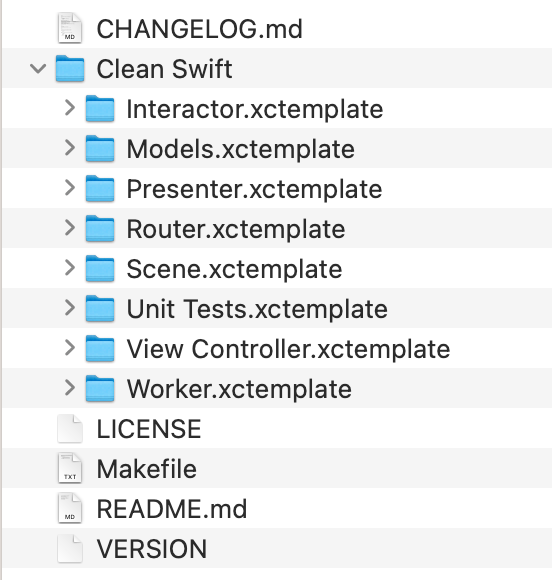

в терминале переходим в эту директорию и набираем команду:

```
make install_templates
```
в результате папка с шаблонами скопируется в папку шаблонов Xcode
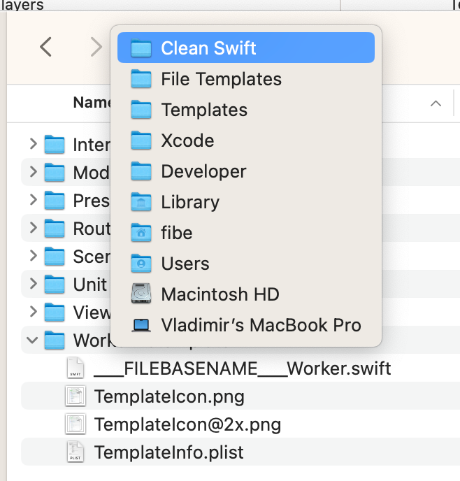

в дилоговом окне создания нового файла появится раздел Clean Swift
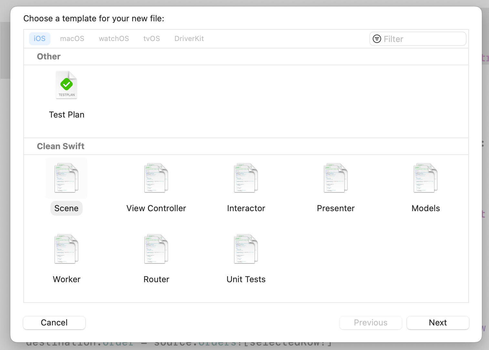

# The "Create Order" Use Case
Этот пример переписан без использования Storyboard. 

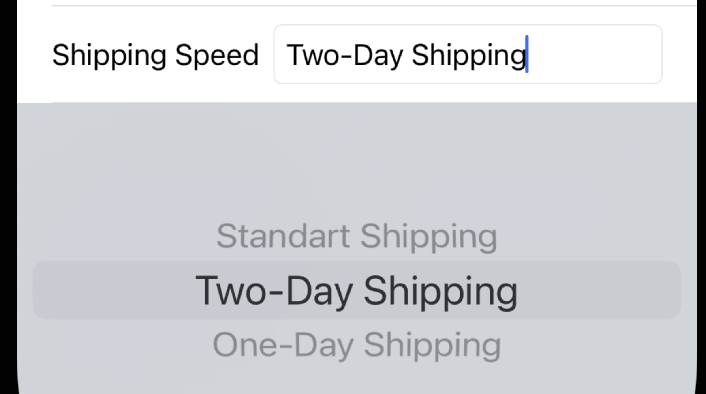

Нам необходимо вывести способы доставки. Так как они могут изменяться, то мы их можем разместить в interator

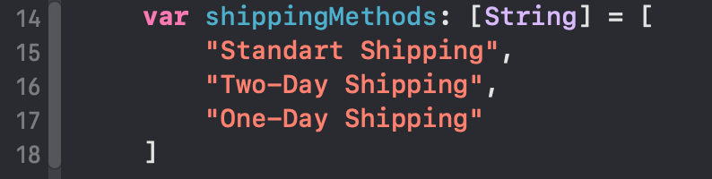

А в контролере получить доступ к этому массиву

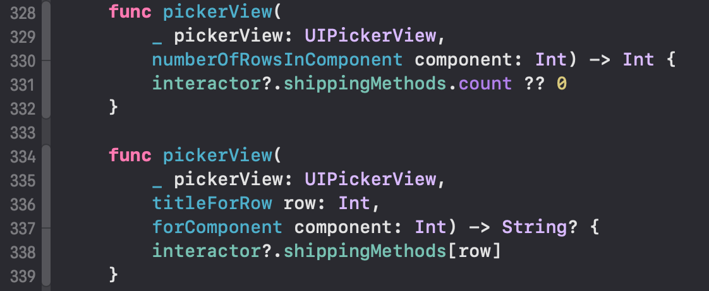

Следующая задача - перенести дату, полученную в UIDataPicker, в поле UITextField
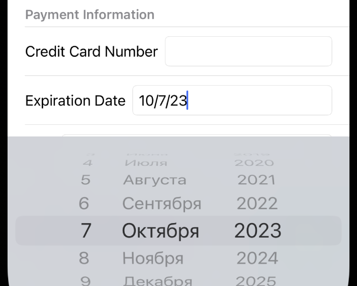

Создаем модель, где в Request и Response передаем Date, а во viewmodel, которая прийдет для отображения в контроллер, уже фигурирует String
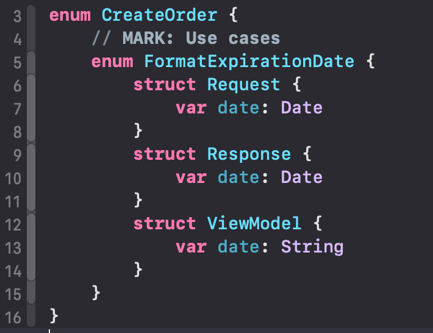

В контроллере, после того, как значение изменилось, срабатывает функция, в которой мы передаем запрос в interactor
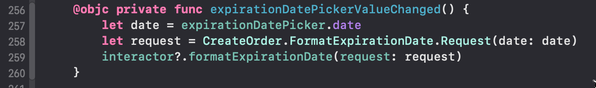

там мы его как есть перебрасываем в presenter
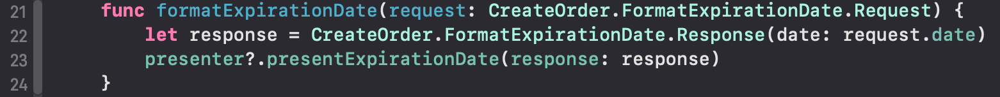

в presenter мы форматируем Date в Sting и передаем в контроллер
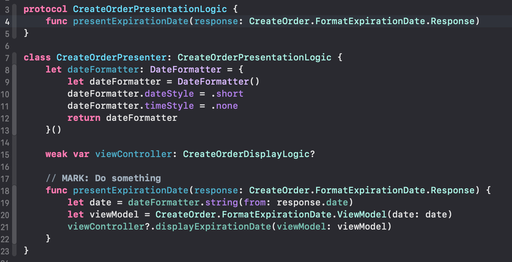

конроллер выводит полученную строку в UITextField
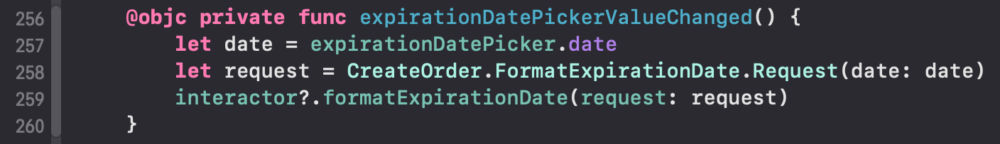

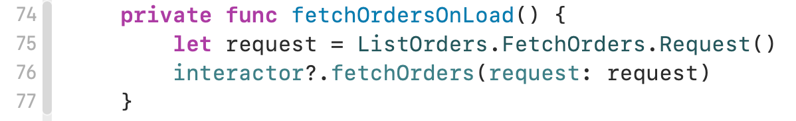

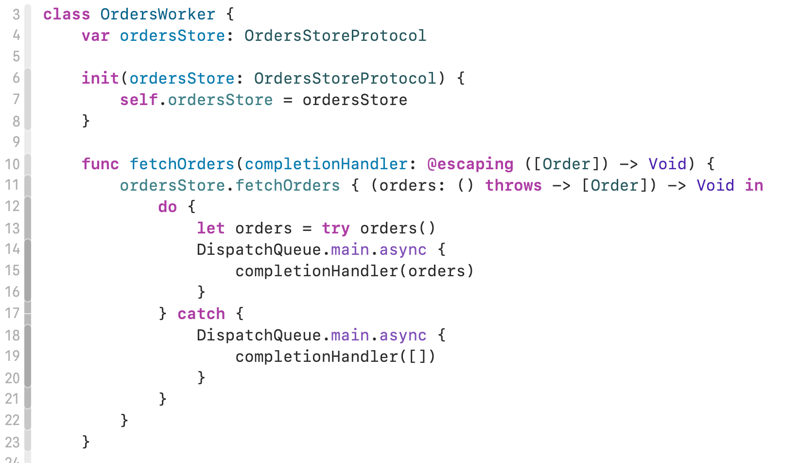
- [Routing without segues](https://stackoverflow.com/questions/48185213/clean-swift-routing-without-segues)
- [Router и Data Passing архитектуры Clean Swift](https://habr.com/ru/articles/454032/)
- [Clean, Simple and Composable Routing in Swift for iOS Apps - Part 1](https://cassiuspacheco.com/clean-simple-and-composable-routing-for-ios-apps)
