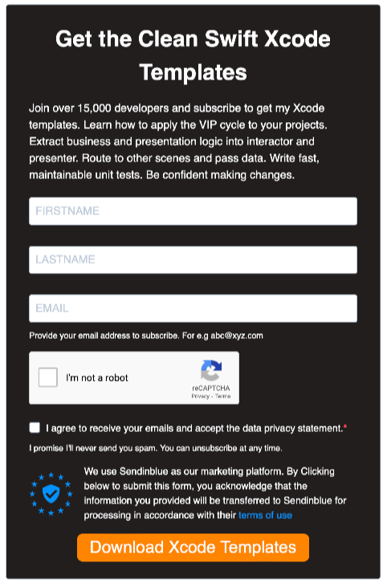

#  Clean Swift

- [Routing without segues](https://stackoverflow.com/questions/48185213/clean-swift-routing-without-segues)
- [Router и Data Passing архитектуры Clean Swift](https://habr.com/ru/articles/454032/)
- [Clean, Simple and Composable Routing in Swift for iOS Apps - Part 1](https://cassiuspacheco.com/clean-simple-and-composable-routing-for-ios-apps)

# Установка

На сайте [clean-swift.com](https://clean-swift.com) необходимо заполнить форму



Получите ссылку на архив с шаблонами.


в терминале переходим в эту директорию и набираем команду:

```
make install_templates
```


